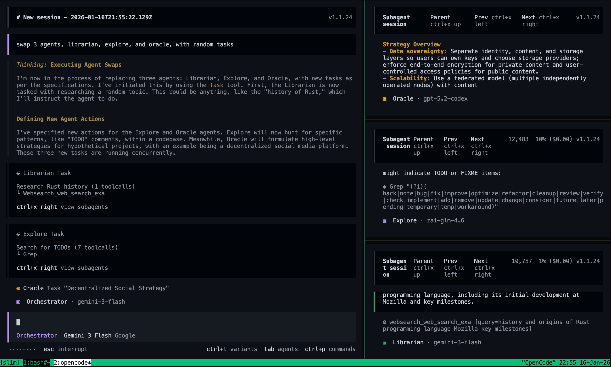

# Multiplexer Integration Guide

Use tmux or Zellij to watch subagents work in live panes while OpenCode keeps running in your main session.

## Table of Contents

- [Overview](#overview)
- [Quick Start](#quick-start)
- [Configuration](#configuration)
- [Layouts](#layouts)
- [Troubleshooting](#troubleshooting)
- [Advanced Usage](#advanced-usage)

---

## Overview

When OpenCode launches child agent sessions, oh-my-opencode-slim can open panes for those sessions automatically.

- **Real-time visibility** into agent activity
- **Automatic pane management** while tasks run
- **Easy debugging** by jumping into live sessions
- **Support for multiple projects** on different sessions or ports



*OpenCode running in tmux with live subagent panes.*

> ⚠️ **Current workaround:** Start OpenCode with `--port` to enable multiplexer integration. The port must match the `OPENCODE_PORT` environment variable. This is required until [opencode#9099](https://github.com/anomalyco/opencode/issues/9099) is resolved.

If you open multiple OpenCode sessions, use a random high port for each launch instead of hard-coding `4096`.

**Bash helper:**

```bash
omos() {
  local port
  port=$(jot -r 1 49152 65535)
  OPENCODE_PORT="$port" \
  opencode --port "$port" "$@"
}
```

---

## Quick Start

### 1. Enable the multiplexer

Edit `~/.config/opencode/oh-my-opencode-slim.json` (or `.jsonc`):

**Auto-detect (recommended):**

```jsonc
{
  "multiplexer": {
    "type": "auto",
    "layout": "main-vertical",
    "main_pane_size": 60,
    "panel_rows_per_column": 3
  }
}
```

**Tmux only:**

```jsonc
{
  "multiplexer": {
    "type": "tmux",
    "layout": "main-vertical",
    "main_pane_size": 60,
    "panel_rows_per_column": 3
  }
}
```

**Zellij only:**

```jsonc
{
  "multiplexer": {
    "type": "zellij"
  }
}
```

### 2. Start OpenCode inside tmux or Zellij

**Tmux:**

```bash
tmux
opencode --port 4096
```

**Zellij:**

```bash
zellij
opencode --port 4096
```

### 3. Trigger delegated work

Ask OpenCode to do something that launches subagents. New panes should appear automatically.

Example:

```text
Please analyze this codebase and create a documentation structure.
```

---

## Configuration

### Multiplexer Settings

```jsonc
{
  "multiplexer": {
    "type": "auto",
    "layout": "main-vertical",
    "main_pane_size": 60,
    "panel_rows_per_column": 3
  }
}
```

| Setting | Type | Default | Description |
|---------|------|---------|-------------|
| `type` | string | `"none"` | `"auto"`, `"tmux"`, `"zellij"`, or `"none"` |
| `layout` | string | `"main-vertical"` | Layout preset for tmux only (`main-vertical`, `main-horizontal`, `right-even-8`, `right-even-2col-4`, `tiled`, `even-horizontal`, `even-vertical`); `right-even-8` 固定左右各 `1/2`，右侧单列均分高度，最多 8 个 pane；`right-even-2col-4` 固定左右各 `1/2`，`1-4` 保持田字阶段（`3` 为上二下一，`4` 为 2x2）；`4→5` 触发一次单列均分重构，`5-8` 后续纵向堆叠，回落到 `<5` 时再触发一次田字重构 |
| `main_pane_size` | number | `60` | Main pane size percentage for tmux only (`20`-`80`) |
| `max_panel_panes` | integer | `8` | Global panel count cap (`1-8`); overflow sessions enter pending queue and are promoted FIFO when capacity frees (`right-even-2col-4` uses threshold-triggered reflow: `4→5` single-column average, `<5` fallback to 田字) |
| `panel_rows_per_column` | integer | `3` | Tmux panel rows per column (`2-5`), fixed max 2 columns; layout capacity = `2 × rows` (range `[4-10]`), final visible cap still limited by `max_panel_panes`; when column 2 is active, main + each panel column are approximately `1/3` width（`right-even-8` 与 `right-even-2col-4` 布局不使用该项） |

### Supported Multiplexers

| Multiplexer | Status | Notes |
|-------------|--------|-------|
| **Tmux** | ✅ Supported | Full layout control with `main-vertical`, `main-horizontal`, `tiled`, and more |
| **Zellij** | ✅ Supported | Creates a dedicated `opencode-agents` tab and reuses the default pane |

### Legacy tmux config

Older configs still work:

```jsonc
{
  "tmux": {
    "enabled": true,
    "layout": "main-vertical",
    "main_pane_size": 60,
    "panel_rows_per_column": 3
  }
}
```

This is converted automatically to `multiplexer.type: "tmux"`.

---

## Layouts

These layouts apply to **tmux only**:

| Layout | Description |
|--------|-------------|
| `main-vertical` | Your session on the left, agents stacked on the right |
| `main-horizontal` | Your session on top, agents stacked below |
| `right-even-8` | Main fixed at left `1/2`; right side uses a single evenly stacked column (up to 8) |
| `right-even-2col-4` | Main fixed at left `1/2`; threshold-triggered reflow: `1-4` stays 田字阶段 (`3` top-2/bottom-1, `4` is 2x2), `4→5` triggers single-column average once, `5-8` then appends vertically, dropping back to `<5` triggers 田字 rebuild |
| `tiled` | All panes in an equal-sized grid |
| `even-horizontal` | All panes side by side |
| `even-vertical` | All panes stacked vertically |

**Example: wide-screen layout**

```jsonc
{
  "multiplexer": {
    "type": "tmux",
    "layout": "main-horizontal",
    "main_pane_size": 50
  }
}
```

**Example: maximum parallel visibility**

```jsonc
{
  "multiplexer": {
    "type": "tmux",
    "layout": "tiled",
    "main_pane_size": 50
  }
}
```
